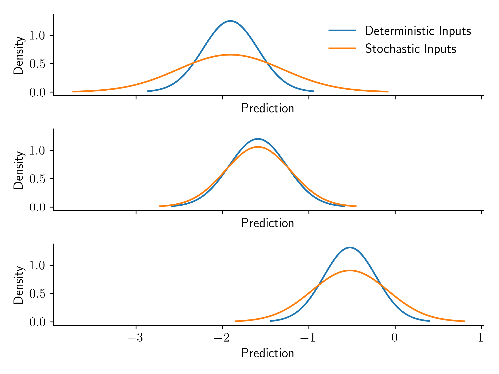

# Gaussian Process w/ Stochastic Inputs

Preliminiary exploration of the capability for Gaussian process regression to handle noisy inputs.

References:

* [Girard, A., Rasmussen, C., Candela, J. Q., & Murray-Smith, R. (2002)](https://proceedings.neurips.cc/paper_files/paper/2002/file/f3ac63c91272f19ce97c7397825cc15f-Paper.pdf)
* [Candela, J. Q., Girard, A., Larsen, J., & Rasmussen, C. E. (2003, April)](https://ieeexplore.ieee.org/abstract/document/1202463?casa_token=FyiF5aTxFjUAAAAA:ylj6_mjR-k-XXnwiRGOyF3eIbXzTb6r1_Aja0kwRpJGydGV6su2wV60HV0F_B04M5dSjA2EVldYo)

